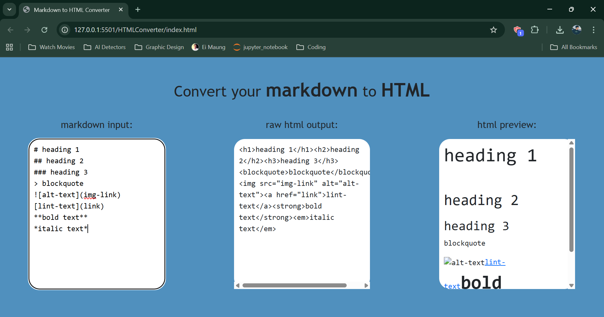
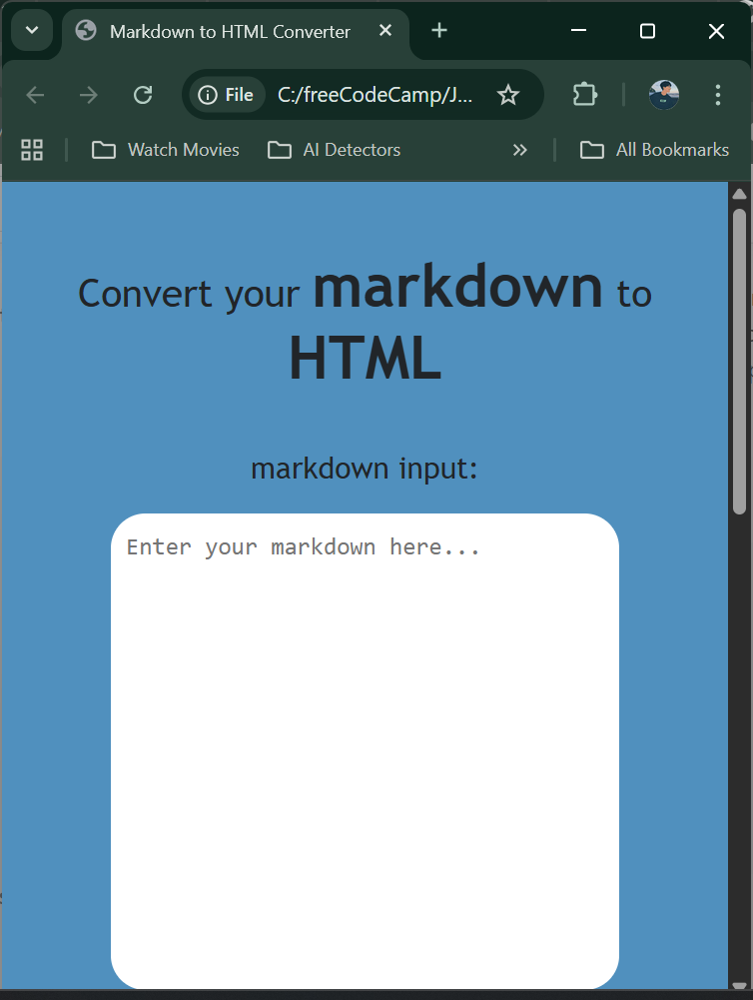

# Markdown to HTML Converter

A simple web-based tool that converts Markdown input into HTML in real time.

🔗 Live Demo: https://matthew1835.github.io/markdown-to-html-converter/

## Features
- Real-time Markdown to HTML conversion
- Clean and simple UI

## Screenshot

## Tech Stack
- HTML
- CSS
- JavaScript
- Bootstrap
